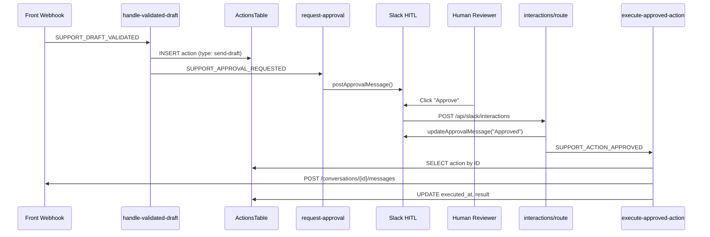
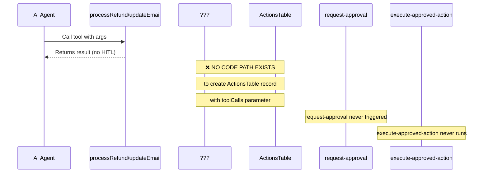
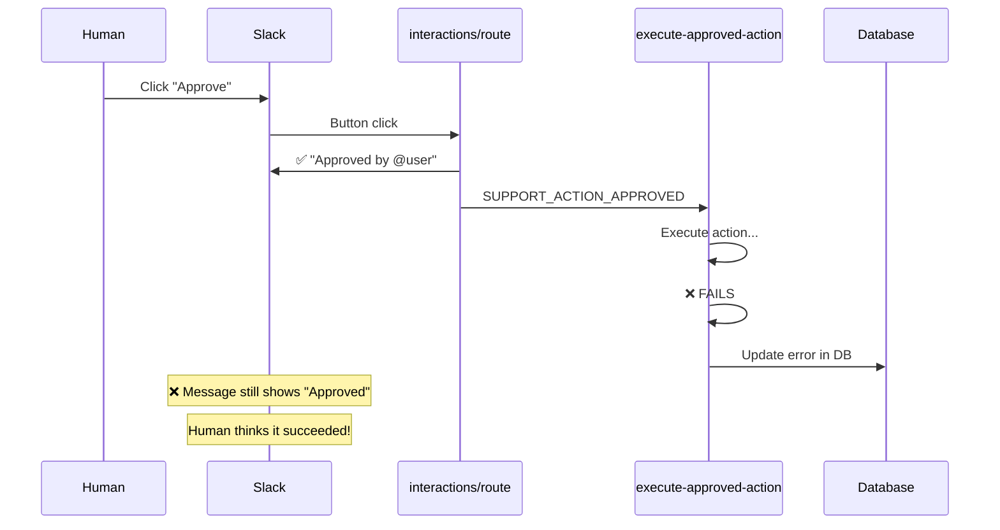

# HITL System Audit Findings

**Date:** 2026-02-03  
**Issue:** #126  
**Auditor:** Grimlock (agent)

## Executive Summary

Comprehensive audit of the Slack Human-in-the-Loop (HITL) system. The **draft approval flow works end-to-end correctly**. However, **tool-based flows (refund, email transfer) lack the code path to create ActionsTable records**, and error handling does not update Slack messages on execution failure.

### Status by Flow

| Flow | Status | Notes |
|------|--------|-------|
| Draft Approval | ✅ Works | Full E2E verified |
| Process Refund | ❌ Broken | No ActionsTable record creation |
| Email Transfer | ❌ Broken | No ActionsTable record creation |
| Assign to Instructor | ❌ Broken | No ActionsTable record creation |
| Error Handling | ⚠️ Partial | DB updated, Slack message NOT updated |
| Idempotency | ⚠️ Missing | Re-approval can re-execute |

---

## Flow 1: Draft Approval ✅ WORKING

### Flow Diagram



### Code Path

1. **handle-validated-draft.ts:170-200** — Creates ActionsTable record with `type: 'send-draft'`, stores draft content in `parameters.draft`
2. **handle-validated-draft.ts:509** — Emits `SUPPORT_APPROVAL_REQUESTED`
3. **request-approval.ts:84-140** — Posts Slack message with approve/reject buttons
4. **interactions/route.ts:65-96** — Handles button click, emits `SUPPORT_ACTION_APPROVED`
5. **execute-approved-action.ts:124-203** — Detects `type === 'send-draft'`, sends via `POST /conversations/{id}/messages`

### Verification

- ✅ ActionsTable record created with correct type
- ✅ Slack message posted with interactive buttons
- ✅ Button click emits correct events
- ✅ Message sent to customer (not draft created)
- ✅ Audit comment added for auto-sends
- ✅ Status updated in DB

---

## Flow 2: Tool-Based Actions ❌ BROKEN

### The Problem

The `execute-approved-action` workflow **can execute** tool calls if they exist:

```typescript
// execute-approved-action.ts:306-334
const params = action.parameters as {
  toolCalls?: Array<{ name: string; args: Record<string, unknown> }>
}
const toolCalls = params?.toolCalls || []

if (toolCalls.length === 0) {
  return { success: false, output: null, error: 'No tool calls found' }
}

for (const toolCall of toolCalls) {
  if (toolName === 'processRefund') { /* execute */ }
  if (toolName === 'updateEmail') { /* execute */ }
  if (toolName === 'assignToInstructor') { /* execute */ }
}
```

**But nothing creates ActionsTable records with `toolCalls` in parameters.**

### Where ActionsTable Inserts Happen

```bash
$ grep -rn "ActionsTable" packages/core/src/ --include="*.ts" | grep "insert"
```

Only 3 locations:
1. `comment-correction.ts:219` — For draft corrections only
2. `handle-validated-draft.ts:170` — For send-draft (auto-approve path)
3. `handle-validated-draft.ts:279` — For send-draft (human approval path)

**None of these create records for tool-based flows.**

### Missing Flow Diagram



### What Needs to Be Built

A new workflow or mechanism to:
1. Intercept tool calls that require approval (based on `requiresApproval` function)
2. Create ActionsTable record with `toolCalls` in parameters
3. Emit `SUPPORT_APPROVAL_REQUESTED`
4. After approval, `execute-approved-action` can then execute

### File References

- **Tool definitions with `requiresApproval`:**
  - `packages/core/src/tools/process-refund.ts:55-67`
  - `packages/core/src/tools/create-tool.ts` (base helper)
  
- **Execution code that expects toolCalls:**
  - `packages/core/src/inngest/workflows/execute-approved-action.ts:306-420`

---

## Flow 3: Error Handling ⚠️ PARTIAL

### Current Behavior

When a human clicks "Approve":
1. ✅ Slack message immediately updated to "Approved by @user"
2. ✅ `SUPPORT_ACTION_APPROVED` event emitted
3. `execute-approved-action` runs...
4. If execution **fails**:
   - ✅ ActionsTable.error set
   - ✅ ApprovalRequestsTable.status = 'rejected'
   - ❌ **Slack message NOT updated to show failure**

### The Problem



### Code Path

- **Immediate update (works):** `interactions/route.ts:86-96`
- **No failure update:** `execute-approved-action.ts` has no call to `updateApprovalMessage` on failure

### What Needs to Be Built

In `execute-approved-action`, after execution failure:
1. Fetch `slack_message_ts` and `slack_channel` from ApprovalRequestsTable
2. Call `updateApprovalMessage()` with failure status

---

## Flow 4: Idempotency ⚠️ MISSING

### Current Behavior

If a user clicks "Approve" twice (race condition, network retry, etc.):
1. Two `SUPPORT_ACTION_APPROVED` events emitted
2. Two `execute-approved-action` runs trigger
3. Action could execute twice (double refund, double email send)

### The Problem

```typescript
// execute-approved-action.ts:76-98 - lookup-action step
const [actionRecord] = await db
  .select()
  .from(ActionsTable)
  .where(eq(ActionsTable.id, actionId))

// ❌ No check if actionRecord.executed_at is already set
// ❌ No atomic "claim" of the action for execution
```

### What Needs to Be Built

1. **Check before execute:** If `executed_at` is set, return early
2. **Atomic claim:** Use `UPDATE ... WHERE executed_at IS NULL` pattern
3. **Slack-side guard:** Check before emitting events in interactions route

---

## Recommendations

### Priority 1: Fix Tool-Based Flow (Critical)
Create mechanism to generate ActionsTable records for tool calls requiring approval.

**Options:**
- A) Add `pending-tool-approval` workflow triggered by agent pipeline
- B) Modify tool execution to create records before returning
- C) Add approval step in the agent's tool calling logic

### Priority 2: Update Slack on Failure (Important)
Modify `execute-approved-action` to update Slack message when execution fails.

### Priority 3: Add Idempotency (Safety)
Add guards to prevent double-execution of approved actions.

---

## Test Coverage Gaps

| Test | Current | Needed |
|------|---------|--------|
| Draft approval E2E | ✅ Exists | — |
| Refund approval E2E | ❌ Missing | Integration test |
| Email transfer E2E | ❌ Missing | Integration test |
| Execution failure → Slack update | ❌ Missing | Unit test |
| Double-approval handling | ❌ Missing | Unit test |

---

## Appendix: Key File Locations

```
packages/core/src/inngest/workflows/
├── execute-approved-action.ts   # Executes approved actions
├── handle-validated-draft.ts    # Creates draft action records
└── request-approval.ts          # Posts Slack messages, waits for decision

apps/slack/app/api/slack/interactions/
└── route.ts                     # Handles button clicks

packages/core/src/tools/
├── process-refund.ts           # Refund tool (has requiresApproval)
├── update-email.ts             # Email tool
└── create-tool.ts              # Tool factory
```
