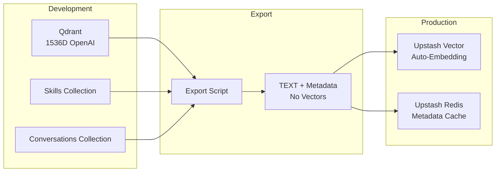
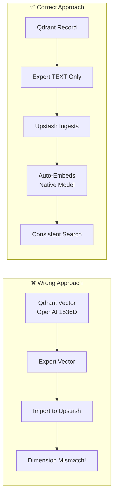
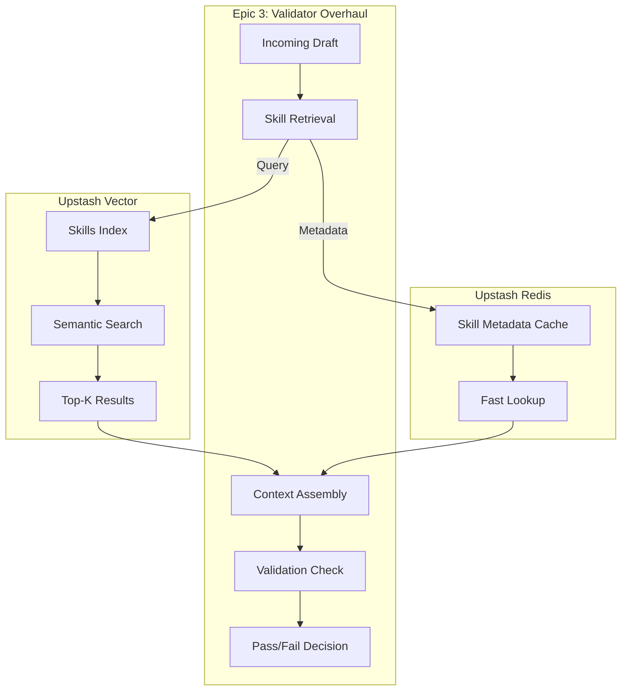

# Skills Migration Proposal: Qdrant → Upstash Vector

## Overview

This document outlines the migration strategy for skills data from local Qdrant (development) to Upstash Vector + Redis (production).

**Key Insight:** Export TEXT to Upstash, not Qdrant embeddings — Upstash auto-embeds with its own model for consistent search.

## Architecture



## Data Flow

```mermaid
flowchart TD
    subgraph Source["Source (Qdrant)"]
        SK1[Skill Record]
        SK2[skill_id: string]
        SK3[content: string]
        SK4[vector: float[1536]]
        SK5[metadata: object]
    end
    
    subgraph Transform["Transform (Export)"]
        TR1[Extract TEXT fields]
        TR2[Preserve metadata]
        TR3[Drop vectors]
        TR4[Format for Upstash]
    end
    
    subgraph Target["Target (Upstash)"]
        UP1[Skill Record]
        UP2[id: string]
        UP3[data: string]
        UP4[metadata: object]
        UP5[vector: auto-generated]
    end
    
    SK1 --> TR1
    SK3 --> TR1
    SK5 --> TR2
    SK4 -.->|DROPPED| TR3
    TR1 --> TR4
    TR2 --> TR4
    TR4 --> UP1
    UP1 --> UP5
```

## Embedding Strategy



### Why Export TEXT, Not Vectors

| Aspect | Export Vectors | Export Text |
|--------|---------------|-------------|
| Dimension compatibility | ❌ Must match exactly | ✅ Upstash decides |
| Model consistency | ❌ Mixed models = poor search | ✅ Single model |
| Future flexibility | ❌ Locked to original model | ✅ Upstash can upgrade |
| Simplicity | ❌ Complex dimension handling | ✅ Just text + metadata |

## Validator Integration (Epic 3)



### Integration Points

1. **Skill Retrieval** — Query Upstash Vector with draft context
2. **Metadata Lookup** — Redis cache for fast skill metadata access
3. **Context Assembly** — Combine relevant skills with draft for validation
4. **Validation** — Enhanced validator with skill-aware context

## Migration Steps

1. **Export from Qdrant**
   ```bash
   bun scripts/export-skills-text.ts --output artifacts/skills-export.jsonl
   ```

2. **Transform for Upstash**
   ```bash
   bun scripts/transform-for-upstash.ts --input artifacts/skills-export.jsonl
   ```

3. **Import to Upstash Vector**
   ```bash
   bun scripts/import-upstash-vector.ts --input artifacts/skills-upstash.jsonl
   ```

4. **Populate Redis Cache**
   ```bash
   bun scripts/populate-upstash-redis.ts --input artifacts/skills-metadata.jsonl
   ```

## Related

- [DATA-ARCHITECTURE.md](./DATA-ARCHITECTURE.md) — Full local vs production architecture
- [Epic 3: Validator Overhaul](https://github.com/skillrecordings/support/issues/28)
- [Upstash Vector Docs](https://upstash.com/docs/vector/overall/getstarted)

## References

- Vercel: [Use skills in AI SDK agents via bash-tool](https://vercel.com/changelog/use-skills-in-your-ai-sdk-agents-via-bash-tool)
