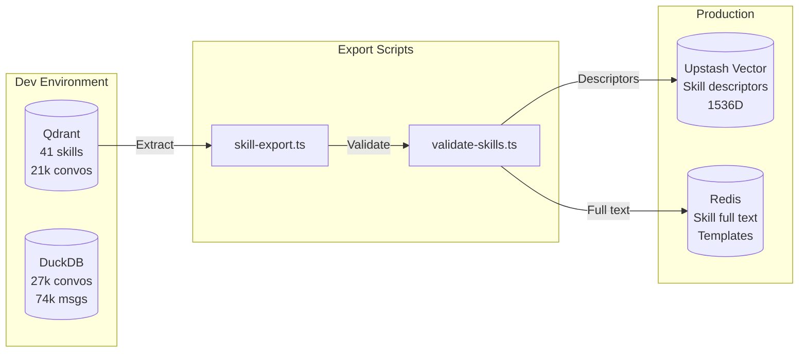
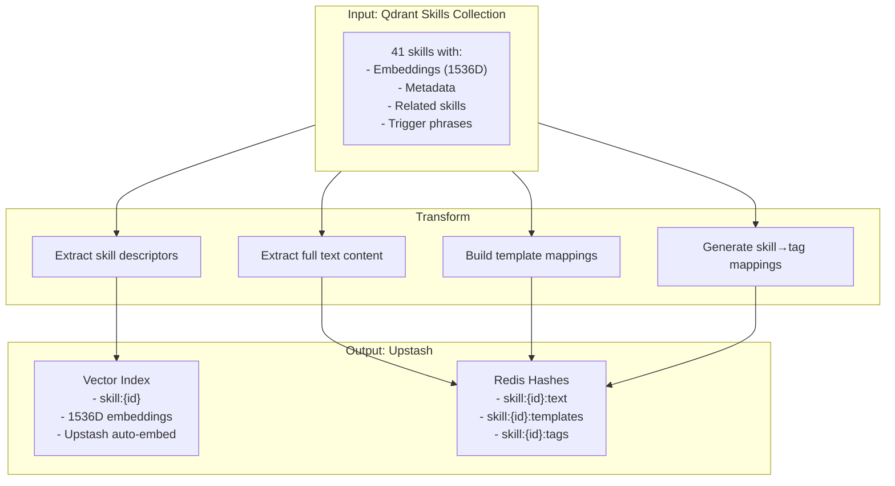
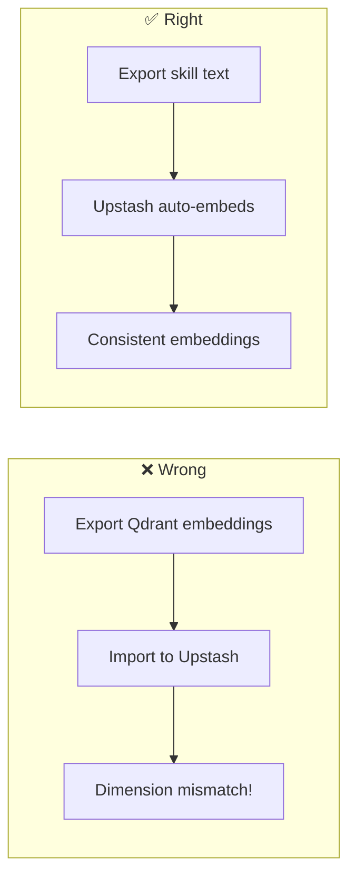
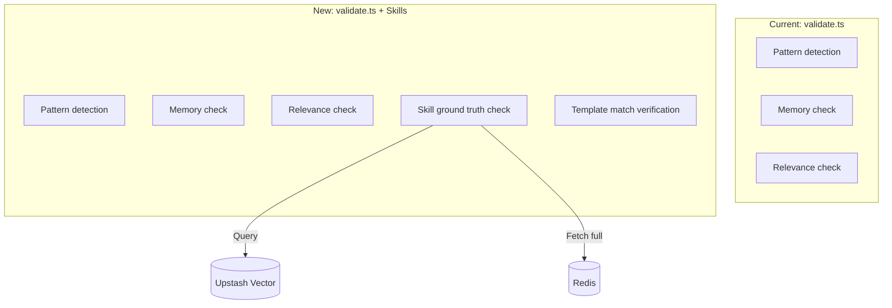

# Skills → Production Migration Proposal

## Overview

Migrate 41+ validated skills from dev Qdrant to production Upstash infrastructure.

**Source:** Qdrant (localhost:6333) — dev/analysis
**Target:** Upstash Vector (descriptors) + Redis (full text) — production

## Architecture



## Data Flow



## Upstash Embedding Strategy

**Critical:** Upstash Vector uses its own embeddings — we export TEXT, not vectors.



## Export Script Design

### 1. `scripts/export-skills-to-upstash.ts`

```typescript
// Pseudocode
async function exportSkills() {
  // 1. Fetch all skills from Qdrant
  const skills = await qdrant.scroll('skills', { limit: 100 })
  
  // 2. For each skill
  for (const skill of skills) {
    // 2a. Extract descriptor text for vector search
    const descriptor = buildDescriptor(skill)
    
    // 2b. Upsert to Upstash Vector (auto-embeds)
    await upstashVector.upsert({
      id: skill.id,
      data: descriptor,  // TEXT, not embedding
      metadata: {
        name: skill.name,
        category: skill.category,
        tags: skill.tags
      }
    })
    
    // 2c. Store full content in Redis
    await redis.hset(`skill:${skill.id}`, {
      text: skill.fullText,
      templates: JSON.stringify(skill.templates),
      relatedSkills: JSON.stringify(skill.relatedSkills),
      triggerPhrases: JSON.stringify(skill.triggerPhrases)
    })
  }
}
```

### 2. `scripts/validate-prod-skills.ts`

```typescript
// Verify migration integrity
async function validateMigration() {
  // 1. Count check
  const qdrantCount = await qdrant.count('skills')
  const upstashCount = await upstashVector.info()
  
  // 2. Sample queries
  const testQueries = ['refund request', 'license transfer', 'access issues']
  for (const query of testQueries) {
    const qdrantResults = await qdrant.search('skills', query)
    const upstashResults = await upstashVector.query(query)
    // Compare top-3 overlap
  }
  
  // 3. Redis integrity
  for (const skillId of sampleIds) {
    const redisData = await redis.hgetall(`skill:${skillId}`)
    assert(redisData.text, `Missing text for ${skillId}`)
  }
}
```

## Validator Integration



## Migration Steps

| Step | Task | Owner | Estimate |
|------|------|-------|----------|
| 1 | Create `export-skills-to-upstash.ts` | Agent | S |
| 2 | Create `validate-prod-skills.ts` | Agent | S |
| 3 | Run export (41 skills) | Agent | 5 min |
| 4 | Validate migration | Agent | 5 min |
| 5 | Wire into validator (Epic 3) | Agent | M |
| 6 | Add 4 new gap-analysis skills | Agent | S |

## Environment Config

```bash
# .env.local additions
UPSTASH_VECTOR_URL=https://...upstash.io
UPSTASH_VECTOR_TOKEN=...
UPSTASH_REDIS_URL=redis://...
UPSTASH_REDIS_TOKEN=...
```

## Rollback Plan

If issues in prod:
1. Validator falls back to pattern-only checks (current behavior)
2. Skills remain in Qdrant for analysis
3. No data loss — migration is additive

## Success Criteria

- [ ] 41+ skills in Upstash Vector
- [ ] Full text + templates in Redis
- [ ] Validator can query skills for ground truth
- [ ] Query latency < 100ms (Upstash SLA)
- [ ] No regression in existing validation

---

**Next:** Create GitHub issue with subtasks and start implementation.
